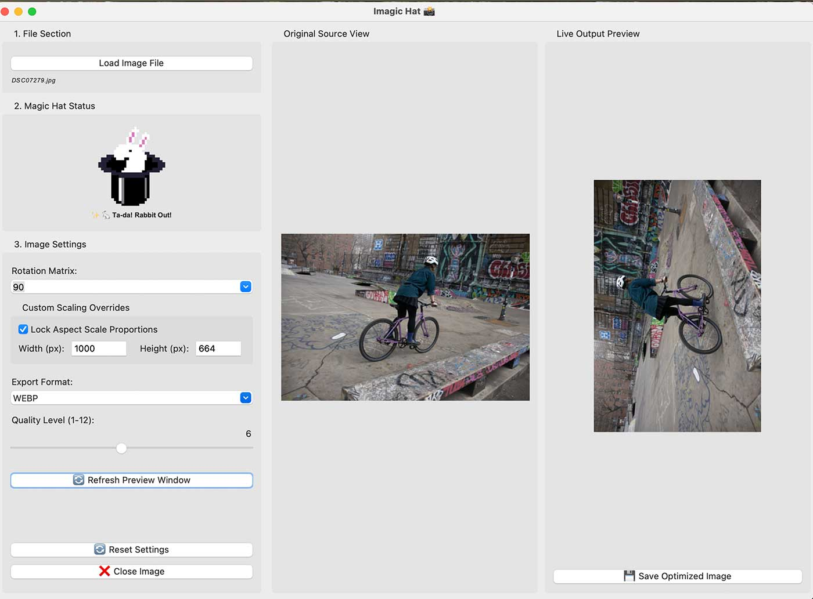

# Imagic Hat (Python Image + Magic Hat)
<span style="font-size: 5em;">🂡 🂱 🃁 🃑 </span>

**Drop your image(s) onto the magic hat and prestidigitationally convert, resize, reformat or animate and save the new image!**



Tkinter desktop app.

## A Python/TKINTER GUI desktop app for easy Pillow image manipulations
1. Resize Images
2. Convert Image Types
3. Save and Optimize for Web
4. Make animated gifs out of still images

## Interface
1. Drop an image or set of images on the magic hat
2. Adjust and refine the settings
3. Press Save
4. MAGIC MODE -> when activated just drop the image on the hat and it instantly saves according to the settings!
5. Settings -> A few defaults / Save your defaults / adjust...
    - size
    - crop
    - ratio
    - format (defaults to same)
    - keep transparency? 
        - set background color
    - animation?
        - speed
        - is infinite?
    - quality

## Notes
- Keep program relatively 'flat' as this is Harvard CS50P final project, otherwise would make a couple packages. 
- Architecture: 
    - main: GUI and "pieced together" image functions
    - constants: RAW files types, resample filters, etc.
    - image_lib: This should contain the function components that make up the image ops.
- For the classes to hold things like image settings that can be tweaked by the user, I am using the built-in dataclasses library from Python: https://docs.python.org/3/library/dataclasses.html
As this class really holds an array of data, it seems like the perfect fit and a way to cut down on boiler-plate code, i.e. (__init__, self.quality = ...
)
- Considered this: - **tkinterdnd2**: Drag and drop library for TKINTER - https://pypi.org/project/tkinterdnd2/ 
but the drag & drop functionality was outside the scope of built in libraries and seemed a bit tenuous. Would be better for a native app or more full featured desktop GUI framework.
- Tkinter is JUST TOO SLOW! 

## Libraries
- **Pillow**: Image processing
- **Rawpy**: Library that decodes raw image formats
- **Pillow-Heif**: Lets Pillow reid HEIF (iPhone image) files


- **Pytest**: Unit testing

```pip freeze > requirements.txt```

Run tests locally:
```python -m pytest```
Otherwise
```pytest```